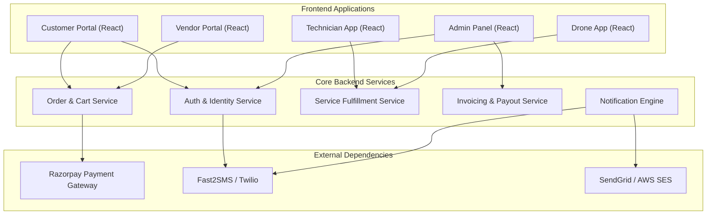
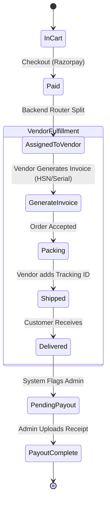
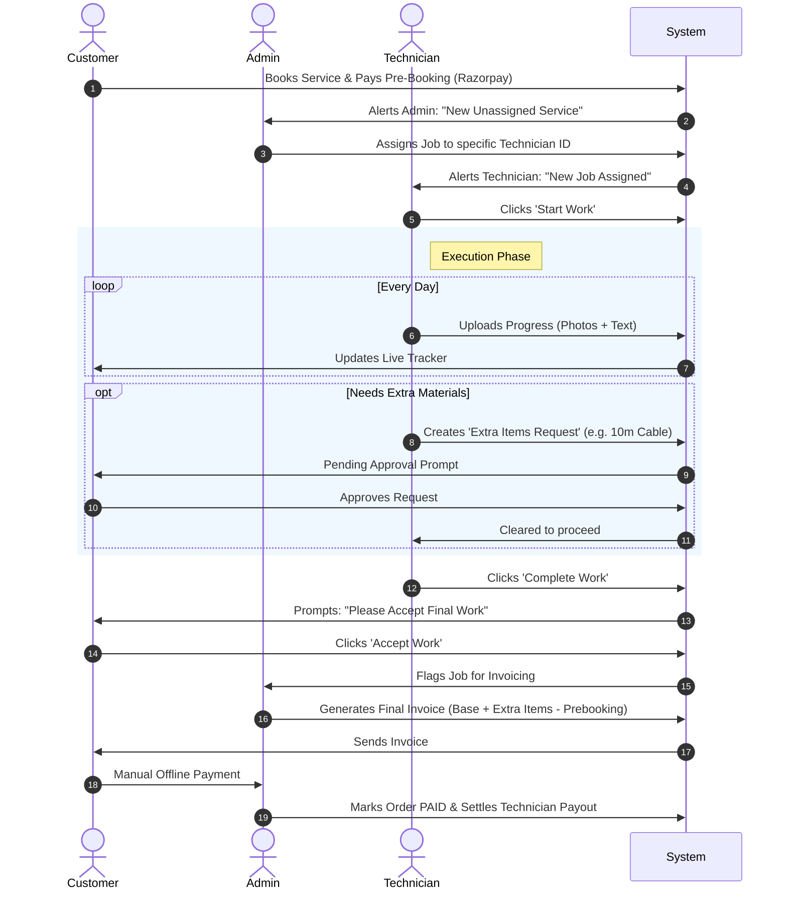

# The Complete Master Product Requirements & Architecture Document
## Assure Technologies Ecosystem

---

## 1. Executive Summary & Vision Statement

Assure Technologies is building a hybrid marketplace model. It bridges the gap between hardware e-commerce and specialized field-service execution. Unlike traditional e-commerce (which ends at delivery) or gig-economy apps (which only provide labor), Assure handles the entire lifecycle: selling the hardware and deploying the specialized labor required to install, operate, or maintain it.

This platform relies on a well-organized 5-portal architecture, centralizing trust and money movement through the Assure Admin, while distributing fulfillment to independent Vendors, Technicians, and Drone Operators.

### 1.1 Core Value Propositions
- **For Customers:** A single pane of glass to buy complex equipment (Biometrics, CCTVs, Agricultural Tools) and instantly book the certified professionals required to use them.
- **For Vendors:** A streamlined pipeline to sell hardware without worrying about customer acquisition or installation logistics.
- **For Technicians & Drone Partners:** A consistent stream of vetted jobs with guaranteed payouts, tracked via an easy-to-use mobile-first portal.
- **For Assure Admins:** Complete control over quality assurance, dispute resolution, quotation generation, and financial margins.

### 1.2 Technology Stack
**Frontend Ecosystem (The 5 Portals):**
- **Framework:** React.js (via Vite)
- **Language:** TypeScript (TSX)
- **Styling:** Custom Vanilla CSS per component
- **Routing:** React Router v6
- **UI Libraries:** React-Icons, SweetAlert2 (Admin), jsPDF & html2canvas (Quotations)

**Backend Ecosystem (The Core Hub):**
- **Framework:** Node.js with Express.js
- **Language:** TypeScript
- **Database:** MySQL
- **Authentication:** JSON Web Tokens (JWT) & bcrypt for password hashing
- **Payment Gateway:** Razorpay API Integration

---

## 2. High-Level Architecture & Topology

The platform operates on a hub-and-spoke model. The Node.js/Express backend serves as the centralized hub, enforcing business logic, database integrity, and communication with external gateways.

---

## 3. Deep-Dive User Personas & Permissions

### 3.1 The Customer
Customers are the economic engine of the platform.
- **Onboarding:** Self-serve. Customers provide their Name, Mobile, Email, and Full Address (including Pincode).
- **Verification:** Mandatory 6-digit SMS OTP verification before the account becomes active.
- **Privileges:** 
  - Read access to public Catalog (Products & Services).
  - Write access to Cart, Checkout, and own Profile.
  - Write access to "Accept Work" or "Approve Extra Items" for their own Service Bookings.
- **Restrictions:** Cannot view Admin pricing, Vendor margins, or other customers' data.

### 3.2 The Assure Administrator (Superuser)
Admins operate the `Assure-AdminPanel` React application.
- **Onboarding:** Seeded via database or created by another Superuser.
- **Privileges (Omnipotent):**
  - Manually assign unassigned Service Bookings to Technicians/Drones based on pincodes.
  - Generate manual Quotations (PDFs) with custom line items and additional charges.
  - Approve and execute manual Payouts to Vendors and Partners.
  - Ban/Suspend users.
  - Edit global product catalog and adjust admin commission percentages.

### 3.3 The Vendor
Vendors supply the physical products sold on the platform.
- **Onboarding:** Manual onboarding by Assure Admin. Admin sets the `admin_commission_percent`.
- **Privileges:**
  - View Orders containing their specific products.
  - Update Shipping Courier and Tracking IDs.
  - Download Payout Receipts uploaded by the Admin.
- **Restrictions:** Cannot see orders belonging to other vendors. Cannot see Service Bookings.

### 3.4 The Field Technician
Technicians handle physical installations and repairs (e.g., CCTV setup).
- **Onboarding:** Manual onboarding by Admin. Linked to specific geographical Pincodes.
- **Privileges:**
  - View assigned jobs.
  - Upload daily progress photos and descriptions.
  - Request "Extra Items" (which flags the Customer).
  - Mark jobs as "Awaiting Final Approval".

### 3.5 The Drone Partner
Drone Partners are a specialized subset of Technicians, handling high-value agricultural spraying.
- **Onboarding:** Manual onboarding by Admin. Linked to regional "Coverage Areas" rather than granular pincodes.
- **Privileges:** Identical to Technicians, but routed through a different frontend URL and assigned exclusively to Drone-category services.

---

## 4. Master Workflows & State Machines

### 4.1 Product Purchase & Fulfillment Flow

**Step-by-Step Breakdown:**
1. Customer adds 2 items from Vendor A, 1 item from Vendor B.
2. Checkout processes a single Razorpay payment for the combined total.
3. The backend router identifies the items and creates two separate logical queues in the Vendor portal.
4. Vendor A logs in, sees their 2 items. They click "Generate Invoice", entering the Model No, HSN Code, and Serial Numbers, which formally accepts the order.
5. Vendor A packs the items and submits "Tracking: AWB123".
6. Once marked `DELIVERED`, the backend calculates `(Price - Commission) = Payable Amount`.
7. Admin sees the generated Invoice under "Vendor Invoices", and the `Payable Amount` in the Payouts dashboard. Admin wires the money, uploads the bank screenshot, and marks it `COMPLETED`.

### 4.2 Comprehensive Service Execution Lifecycle

This is the most complex flow in the platform, requiring multi-party consent.

### 4.3 Quotation Generation Flow

Designed for B2B bulk orders that bypass the standard shopping cart.
1. **Initiation:** Admin clicks "Generate Quotation".
2. **Data Entry:** Input Customer Name, Mobile, Email, GST Number, Company Name, Address.
3. **Line Items:** Admin adds N rows of Services/Products with specific quantities and base costs.
4. **Taxes & Adjustments:** Admin adds a manual text field for "Additional Charges" (e.g., Travel fee: ₹2000) and selects the applicable GST bracket (18%, 12%, 5%).
5. **PDF Generation:** The frontend uses `html2canvas` and `jsPDF` to compile a professional invoice document prefixed with `QTN-XXXX`.
6. **Delivery:** The PDF is downloaded by the Admin and emailed to the corporate client for approval.

---

## 5. Comprehensive Database Schema

To enforce absolute security boundaries between the five portals, all user records are kept in strictly isolated tables.

### 5.1 Identity & Access Tables

**`Admins`**
- `id` (UUID, Primary Key)
- `email` (String, Unique)
- `mobile` (String, Unique)
- `password_hash` (String, bcrypt)
- `full_name` (String)
- `is_active` (Boolean, default: true)
- `created_at` (Timestamp)

**`Customers`**
- `id` (UUID, Primary Key)
- `email` (String, Unique)
- `mobile` (String, Unique)
- `password_hash` (String)
- `full_name` (String)
- `full_address` (Text)
- `pincode` (String, length 6)
- `state_name` (String)
- `is_mobile_verified` (Boolean, default: false)
- `is_active` (Boolean, default: true)
- `created_at` (Timestamp)

**`Vendors`**
- `id` (UUID, Primary Key)
- `email`, `mobile`, `password_hash`, `full_name`
- `business_name` (String)
- `address` (Text)
- `gst_number` (String, length 15)
- `admin_commission_percent` (Decimal)
- `is_active` (Boolean)

**`Technicians` / `DronePartners` (Identical structure, isolated tables)**
- `id` (UUID, Primary Key)
- `email`, `mobile`, `password_hash`, `full_name`
- `address` (Text)
- `service_pincodes` (JSON Array of Strings) OR `coverage_areas` (JSON Array)
- `services_provided` (JSON Array of Service IDs)

### 5.2 Catalog & Inventory Tables

**`Products`**
- `id` (UUID)
- `vendor_id` (FK to Vendors, Nullable if Assure-owned)
- `name` (String, index)
- `category` (String)
- `base_price` (Decimal 10,2)
- `admin_commission` (Decimal 5,2)
- `stock` (Integer)
- `images` (JSON Array of URLs)

**`Services`**
- `id` (UUID)
- `name` (String)
- `category` (String)
- `price_type` (Enum: Fixed, Per_Hour, Per_Acre)
- `prebooking_charge` (Decimal 10,2)
- `custom_fields` (JSON metadata for forms)

### 5.3 Order Lifecycle Tables

**`Orders`**
- `id` (UUID)
- `order_number` (String, e.g., ORD-2026-XYZ)
- `customer_id` (FK to Customers)
- `type` (Enum: PRODUCT, SERVICE)
- `total_amount` (Decimal)
- `payment_status` (Enum: PENDING, PAID, REFUNDED)
- `razorpay_order_id` (String)
- `status` (Enum: NEW, ASSIGNED, IN_PROGRESS, AWAITING_APPROVAL, COMPLETED, CANCELLED, DELIVERED)

**`OrderItems` (Product linkage)**
- `id` (UUID)
- `order_id` (FK to Orders)
- `product_id` (FK to Products)
- `vendor_id` (FK to Vendors)
- `qty` (Integer)
- `price` (Decimal - snapshot of price at checkout)

**`ServiceBookings` (Service linkage)**
- `id` (UUID)
- `order_id` (FK to Orders)
- `service_id` (FK to Services)
- `assigned_partner_id` (FK to Technicians/DronePartners)
- `partner_type` (Enum: TECHNICIAN, DRONE)
- `scheduled_date` (Date)
- `address` (Text)
- `pincode` (String)
- `lat` / `lng` (Decimals for Geolocation)
- `prebooking_paid` (Boolean)

### 5.4 Live Execution & Tracking Tables

**`JobProgress`**
- `id` (UUID)
- `booking_id` (FK to ServiceBookings)
- `description` (Text)
- `photos` (JSON Array of S3 URLs)
- `created_at` (Timestamp)

**`ExtraItemsRequest`**
- `id` (UUID)
- `booking_id` (FK to ServiceBookings)
- `description` (String)
- `qty` (Integer)
- `status` (Enum: PENDING, APPROVED, REJECTED)
- `created_at` (Timestamp)

### 5.5 Financial Settlement Tables

**`Quotations`**
- `id` (UUID)
- `quotation_number` (String, unique)
- `customer_name`, `mobile`, `email`, `company_name`, `gst_number`
- `address`, `pincode`
- `additional_charges_desc` (String)
- `additional_charges` (Decimal)
- `gst_percent` (Decimal)
- `grand_total` (Decimal)
- `date_created` (Timestamp)

**`QuotationServices`**
- `id` (UUID)
- `quotation_id` (FK to Quotations)
- `name` (String)
- `qty` (Integer)
- `cost` (Decimal)
- `total` (Decimal)

**`Invoices`**
- `id` (UUID)
- `invoice_number` (String, e.g., INV-7842)
- `order_id` (FK to Orders)
- `invoice_type` (Enum: VENDOR, SERVICE)
- `vendor_id` (FK to Vendors, nullable)
- `generated_by` (FK to Admins or Vendors)
- `items_metadata` (JSON array storing HSN Codes, Serial Numbers, Warranty)
- `subtotal`, `gst_percent`, `grand_total` (Decimals)
- `pdf_url` (String)

**`Payouts`**
- `id` (UUID)
- `partner_id` (FK)
- `partner_type` (Enum: VENDOR, TECHNICIAN, DRONE)
- `amount` (Decimal)
- `reference_note` (Text)
- `proof_url` (String - Bank receipt screenshot)
- `status` (Enum: PENDING, COMPLETED)

---

## 6. Detailed API Endpoints mapped to the 5 Portals

The backend API is logically segmented to serve the 5 specific frontend applications. Route Guards (JWT Middleware) ensure that a portal can only access its designated endpoints.

### 6.1 Assure-Frontend (Customer App & Public) APIs
- **Auth:** `POST /api/customer/register`, `POST /api/customer/verify-otp`, `POST /api/customer/login`, `POST /api/customer/forgot-password`
- **Catalog:** `GET /api/customer/products`, `GET /api/customer/services`
- **Careers (Public):** `GET /api/public/careers` (List jobs), `GET /api/public/careers/:id`, `POST /api/public/careers/apply`
- **Cart & Checkout:** `POST /api/customer/checkout/cart`, `POST /api/customer/checkout/verify`
- **Order Tracking:** `GET /api/customer/orders`, `GET /api/customer/orders/:id`, `POST /api/customer/orders/:id/cancel` (Cancel pending order)
- **Service Action:** `POST /api/customer/jobs/:id/approve-extra-items`, `POST /api/customer/jobs/:id/reject-extra-items`
- **Service Action:** `POST /api/customer/jobs/:id/accept-final-work`
- **Profile:** `GET /api/customer/profile`, `PUT /api/customer/profile/edit`

### 6.2 Assure-AdminPanel APIs
- **Auth:** `POST /api/admin/login`
- **Catalog:** `POST /api/admin/products`, `PUT /api/admin/products/:id`, `DELETE /api/admin/products/:id` | `POST /api/admin/services`, `PUT /api/admin/services/:id`, `DELETE /api/admin/services/:id`
- **Inventory Oversight:** `GET /api/admin/stock`, `PUT /api/admin/stock/update`
- **Order Oversight:** `GET /api/admin/orders`, `GET /api/admin/vendor-orders`, `POST /api/admin/orders/:id/cancel`
- **Service Management:** `GET /api/admin/service-requests`, `GET /api/admin/jobs/unassigned`, `POST /api/admin/jobs/:id/assign`, `POST /api/admin/jobs/:id/cancel`
- **Partner Management:** 
  - *Manage Partners:* `GET /api/admin/partners`, `POST`, `PUT`, `DELETE`
  - *Manage Partner Types:* `GET /api/admin/partner-types`, `POST`, `PUT`, `DELETE`
  - *Manage Pricing Types:* `GET /api/admin/pricing-types`, `POST`, `PUT`, `DELETE`
  - *Partner Requests:* `GET /api/admin/partner-requests`, `POST /api/admin/partner-requests/:id/approve`, `POST /api/admin/partner-requests/:id/reject`
  - *Partner Assignments:* `GET /api/admin/partner-assignments`
  - *Manage Partner Services:* `GET /api/admin/partner-services`, `POST`, `PUT`, `DELETE`
- **Quotations:** `POST /api/admin/quotations/generate`, `GET /api/admin/quotations`, `PUT /api/admin/quotations/:id`, `DELETE /api/admin/quotations/:id`
- **Invoices & Payouts:** `POST /api/admin/invoices/generate`, `GET /api/admin/payments`, `POST /api/admin/payouts/execute`
- **Careers & Job Portal:** `POST /api/admin/careers`, `GET /api/admin/careers`, `PUT /api/admin/careers/:id`, `DELETE /api/admin/careers/:id`, `GET /api/admin/career-applications` (View applicants)
- **User Management:** `GET /api/admin/vendors`, `PUT`, `DELETE` | `GET /api/admin/customers`, `PUT`, `DELETE`

### 6.3 Assure-Vendor Portal APIs
- **Auth:** `POST /api/vendor/login`
- **Profile:** `GET /api/vendor/profile`, `PUT /api/vendor/profile`
- **Product Management:** `GET /api/vendor/products`, `POST /api/vendor/products/add`, `PUT /api/vendor/products/:id`, `DELETE /api/vendor/products/:id`
- **Inventory:** `GET /api/vendor/inventory`, `PUT /api/vendor/inventory/:productId`
- **Order Management:** `GET /api/vendor/orders`
- **Fulfillment:** `POST /api/vendor/orders/:id/generate-invoice` (Accept Order), `POST /api/vendor/orders/:id/reject` (Reject Order), `POST /api/vendor/orders/:id/update-tracking`
- **Financials:** `GET /api/vendor/payouts`

### 6.4 Assure-Technician App APIs
- **Auth:** `POST /api/technician/login`
- **Job Dashboard:** `GET /api/technician/jobs/assigned`, `GET /api/technician/jobs/history`
- **Execution:** `POST /api/technician/jobs/:id/start`
- **Progress Tracking:** `POST /api/technician/jobs/:id/upload-progress`
- **Materials:** `POST /api/technician/jobs/:id/request-extra-items`
- **Completion:** `POST /api/technician/jobs/:id/complete`
- **Cancellation:** `POST /api/technician/jobs/:id/cancel` (If unable to service)

### 6.5 Assure-Partner App (Drone) APIs
- **Auth:** `POST /api/drone/login`
- **Profile:** `GET /api/drone/profile`
- **Job Dashboard:** `GET /api/drone/jobs/assigned`
- **Execution Lifecycle:** Identical API signatures to the Technician app (`/start`, `/upload-progress`, `/complete`, `/cancel`), but routed through `/api/drone/`.

---

## 7. Next Steps & Execution Plan

With this master PRD finalized, the immediate next phase is the initialization of the **Node.js/Express Backend**. 
The execution will follow this sequence:
1. **Infrastructure Setup:** Initializing Express, TypeScript, and configuring MySQL connection pools.
2. **Database Migration:** Scripting the creation of the 13 isolated tables defined in Section 5.
3. **Core Authentication:** Building the `/api/auth` modules with role-based JWT issuance.
4. **Order Management:** Building basic CRUD for Orders and Quotations.
5. **Admin Operations:** Building the manual assignment and invoice generation endpoints.
